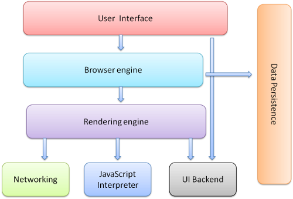
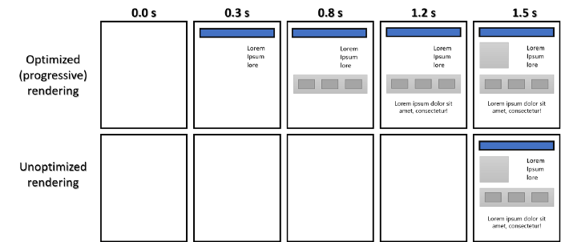
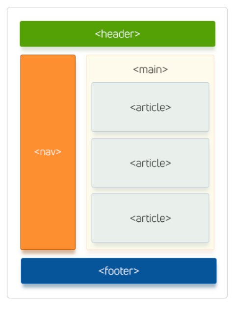

# HTML Basics

> *Click &#9733; if you like the project. Your contributions are heartily ♡ welcome.*

<br/>

## Related Topics

* *[HTML5 Events List](html5-events.md)*
* *[HTML5 Tags](html5-tags.md)*
* *[HTML5 MCQ](html-mcq.md)*
* *[CSS Basics](https://github.com/learning-zone/css-basics)*
* *[JavaScript Basics](https://github.com/learning-zone/javascript-basics)*

<br/>

## Table of Contents

* [Introduction](#-1-introduction)
* [HTML Tags](#-2-html-tags)
* [HTML Events](#-3-html-events)
* [HTML Forms](#-4-html-forms)
* [HTML Tables](#-5-html-tables)
* [HTML Lists](#-6-html-lists)
* [HTML Iframe](#-6-html-iframe)
* [HTML URL](#-6-html-url)
* [HTML SVG](#-7-html-svg)
* [HTML Canvas](#-8-html-canvas)
* [HTML Storage](#-9-html-storage)
* [HTML APIs](#-10-html-apis)
* [HTML Drag and Drop](#-11-html-drag-and-drop)
* [HTML Web Worker](#-12-html-web-worker)
* [HTML Accessibility](#-13-html-accessibility)
* [Miscellaneous](#-14-miscellaneous)

<br/>

## # 1. Introduction

<br/>

## Q. What is the difference between HTML and XHTML?

The Extensible Hypertext Markup Language, or XHTML, has two important notes for front end developers.

1) It needs to be well formed, meaning all elements need to be closed and nested correctly or you will return errors.
2) Since it is more strict than HTML is requires less pre-processing by the browser, which may improve your sites performance.

<div align="right">
    <b><a href="#table-of-contents">↥ back to top</a></b>
</div>

## Q. What are the building blocks of HTML5?

* **Semantics**: allowing you to describe more precisely what your content is.
* **Connectivity**: allowing you to communicate with the server in new and innovative ways.
* **Offline and storage**: allowing webpages to store data on the client-side locally and operate offline more efficiently.
* **Multimedia**: making video and audio first-class citizens in the Open Web.
* **2D/3D graphics and effects**: allowing a much more diverse range of presentation options.
* **Performance and integration**: providing greater speed optimization and better usage of computer hardware.
* **Device access**: allowing for the usage of various input and output devices.
* **Styling**: letting authors write more sophisticated themes.

<div align="right">
    <b><a href="#table-of-contents">↥ back to top</a></b>
</div>

## Q. What are the semantic tags available in HTML5?

HTML5 semantic tags define the function and the category of your text, simplifying the work for browsers and search engines, as well as developers.

HTML5 offers new semantic elements to define different parts of a web page:

* `<article>`
* `<aside>`
* `<details>`
* `<figcaption>`
* `<figure>`
* `<footer>`
* `<header>`
* `<main>`
* `<mark>`
* `<nav>`
* `<section>`
* `<summary>`
* `<time>`

**Syntax:**

```html
<!DOCTYPE html> 

<html>  
   <head> 
      <meta charset = "utf-8"/> 
      <title>...</title> 
   </head> 
  
   <body> 
      <header>...</header> 
      <nav>...</nav> 
      
      <article> 
         <section> 
            ... 
         </section> 
      </article> 
      <aside>...</aside> 
      
      <footer>...</footer> 
   </body> 
</html> 
```

<div align="right">
    <b><a href="#table-of-contents">↥ back to top</a></b>
</div>

## Q. Why you would like to use semantic tag?

* Search Engine Optimization, accessibility, repurposing, light code. 
* Many visually impaired person rely on browser speech and semantic tag helps to interpret page content clearly.
* Search engine needs to understand page content to rank and semantic tag helps.
* Semantic code aids accessibility. Specially, many people whose eyes are not good rely on speech browsers to read pages to them. These programs cannot interpret pages very well unless they are clearly explained.
* Help Search engines to better understand pages. Search engine need to understand what your content is about when rank you properly on search engines. Semantic code tends to improve your placement on search engines, as it is easier for the "search engine spiders" to understand.
* It\'s easier to read and edit, which saves time and money during maintenance.

<div align="right">
    <b><a href="#table-of-contents">↥ back to top</a></b>
</div>

## Q. What does a `<DOCTYPE html>` do?

A DOCTYPE is always associated to a `DTD` ( **Document Type Definition** ). A DTD defines how documents of a certain type should be structured (i.e. a `button` can contain a `span` but not a `div`), whereas a DOCTYPE declares what DTD a document supposedly respects (i.e. this document respects the HTML DTD). For webpages, the DOCTYPE declaration is required. It is used to tell user agents what version of the HTML specifications your document respects. 

Once a user agent has recognized a correct DOCTYPE, it will trigger the `no-quirks mode` matching this DOCTYPE forreading the document. If a user agent doesn't recognize a correct DOCTYPE, it will trigger the `quirks mode`.

<div align="right">
    <b><a href="#table-of-contents">↥ back to top</a></b>
</div>

## Q. What happens when DOCTYPE is not given?

The web page is rendered in quirks mode. The web browsers engines use quirks mode to support older browsers which does not follow the **W3C specifications**. In quirks mode CSS class and id names are case insensitive. In standards mode they are case sensitive.

<div align="right">
    <b><a href="#table-of-contents">↥ back to top</a></b>
</div>

## Q. What are the new form elements in HTML5?

There are five new form elements in the HTML5 forms specification: `<datalist>`, `<output>`, `<progress>`, and `<meter>`. 

**1. Datalist Tag**

Allows to attach a list of suggestions to a text input element. As soon as the user begins to type in the text field, the list of suggestions appears and the user can choose from the suggestions with the mouse.

```html
<p>Enter your favorite browser name:</p>
<input type="text" list="browsers" name="favorite_browser">
<datalist id="browsers">
    <option value="Firefox">
    <option value="Chrome">    
    <option value="Internet Explorer">
    <option value="Opera">
    <option value="Safari">
</datalist>
```

**2. Meter Tag**

Indicates a numeric value that falls within a range. The tag supports a number of attributes:
value: If you don\'t specify a value, the first numeric value inside the `<meter></meter>` pair becomes the value.

* **max**: The maximum possible value of the item.
* **min**: The minimum possible value of the item.
* **high**: If the value can be defined as a range, this is the high end of the range.
* **low**: If the value can defined as a range, this is the low end of that range.
* **optimum**: The optimal value of the element. 

```html
<p>Disk Usage: <meter value="0.2">20%</meter></p>

<p>Total Score: <meter value="6" min="0" max="10">6 out of 10</meter></p>

<p>Pollution Level: <meter low="60" high="80" max="100" value="85">Very High</meter></p>
```

**3. Output Tag**

It indicates a section of the page that can be modified by a script (usually JavaScript).

```html
<form oninput="result.value=parseInt(a.value)+parseInt(b.value)">
  <input type="range" id="a" value="50"> +
  <input type="number" id="b" value="100"> =
  <output name="result" for="a b"></output>
</form>
```

**4. Progress Tag**

Indicates how much of a task has been completed (often marked as a percentage). It is expected to be modified through JavaScript code.

```html
 
<p>Progress: <progress id="bar" value="0" max="100"><span>0</span>%</progress></p>

<script type="text/javascript">
    var i = 0;
    var progressBar = document.getElementById("bar");
    
    function countNumbers() {
      if(i < 100) {
        i = i + 1;
        progressBar.value = i;
        // For browsers that don't support progress tag
        progressBar.getElementsByTagName("span")[0].textContent = i;
      }

      // Wait for sometime before running this script again
      setTimeout("countNumbers()", 100);
    }
    countNumbers();
</script>
```

<div align="right">
    <b><a href="#table-of-contents">↥ back to top</a></b>
</div>

## Q. How many new form elements are introduced in html5?

|Sl.No| Element     | Description   |
|-----|-------------|---------------------------|
| 01. |color        |Gives the end user a native color picker to choose a color.|
| 02. |date         |Offers a datepicker.|
| 03. |datetime     |An element to choose both date and time.|
| 04. |datetime-local |An element to choose both date and time, with local settings support.|
| 05. |email        |A field for entering e-mail address(es).|
| 06. |month       |Choose a full month.|
| 07. |number       |Picking a number.|
| 08. |range        |Offers a slider to set to a certain value/position.|
| 09. |search       |A field for search queries.|
| 10. |tel          |Choosing a telephone number.|
| 11. |time         |Input a certain time.|
| 12. |url          |Entering a URL.|
| 13. |week         |Picking a specific week.|


**Example:**

```html
<input type="color" value="#b97a57">

<input type="date" value="2020-06-08">

<input type="datetime" value="2020-06-09T20:35:34.32">

<input type="datetime-local" value="2020-06-09T22:41">

<input type="email" value="robert@robertnyman.com">

<input type="month" value="2020-06">

<input type="number" value="4">

<input type="range" value="15">

<!-- Note: If not set, default attribute values are min="0", max="100", step="1". -->

<input type="search" value="[Any search text]">

<input type="tel" value="[Any numeric value]">

<!-- Note: Most web browsers seem to let through any value at this time. -->

<input type="time" value="22:38">

<input type="url" value="https://www.google.com/">

<!-- Note: requires a protocol like http://, ftp:// etc in the beginning. -->


<input type="week" value="2020-W24">
```

<div align="right">
    <b><a href="#table-of-contents">↥ back to top</a></b>
</div>

## Q. Create a HTML form with below constraints?

   * Accept User Name, Email, Country and Subject
   * Validate the fields
   * Store data into local Storage
   * Fetch user data and display on right side of the page

```html
<!DOCTYPE html>
<html>
<head>
    <meta charset="UTF-8">
    <meta http-equiv="X-UA-Compatible" content="IE=edge">
    <meta name="viewport" content="width=device-width, initial-scale=1.0">
<style>
  body {font-family: Arial, Helvetica, sans-serif;}
  * {box-sizing: border-box;}
  
  input[type=text], input[type=email], select, textarea {
    width: 100%;
    padding: 12px;
    border: 1px solid #ccc;
    border-radius: 4px;
    box-sizing: border-box;
    margin-top: 6px;
    margin-bottom: 16px;
    resize: vertical;
  }
  
  input[type=submit] {
    background-color: #0e8af7;
    color: white;
    padding: 12px 20px;
    border: none;
    border-radius: 4px;
    cursor: pointer;
  }
  
  input[type=submit]:hover {
    background-color: #1181e3;
  }
  
  .container {
    border-radius: 5px;
    background-color: #f2f2f2;
    padding: 20px;
  }
</style>
</head>
<body>

<h3>Contact Form</h3>

<div class="container">
  <form name="contactForm" onsubmit="return validateForm()" method="post">
    <label for="fname">Name</label>
    <input type="text" id="user_name" name="user_name" placeholder="Your name.." required>

    <label for="lname">Email ID</label>
    <input type="email" id="email" name="email" placeholder="Your Email Address.." required>

    <label for="country">Country</label>
    <select id="country" name="country" required>
      <option value="">--- SELECT ---</option>
      <option value="australia">Australia</option>
      <option value="canada">Canada</option>
      <option value="india">India</option>
      <option value="usa">USA</option>
    </select>

    <label for="subject">Subject</label>
    <textarea id="subject" name="subject" placeholder="Write something.." style="height:200px"></textarea>

    <input type="submit" value="Submit">
  </form>
</div>
<script>
    function validateForm() {
      let name = document.forms["contactForm"]["user_name"].value;
      let email = document.forms["contactForm"]["email"].value;
      let country = document.forms["contactForm"]["country"].value;
      let subject = document.forms["contactForm"]["subject"].value;

      if (name === "" || email === "" || country === "") {
        alert("All the fields are mandatory");
        return false;
      } else { 
        // Create a JSON Object
        const userData = {
          name: name,
          email: email,
          country: country,
          subject: subject
        };

        // Store the object into storage
        localStorage.setItem("userData", JSON.stringify(userData));

        // Retrieve the object from the storage
        const data = localStorage.getItem("userData");
        console.log("data: ", JSON.parse(data));
        
        return false;
      }
    }
</script>
</body>
</html>
```

<div align="right">
    <b><a href="#table-of-contents">↥ back to top</a></b>
</div>

## Q. What is difference between `span` tag and `div` tag?

The primary difference between div and span tag is their default behavior. By default, a `<div>` is a **block-level-element** and a `<span>` is an **inline element**.

* `<div>` is a block level element which means it will render it on it\'s own line with a width of a 100% of the parent element.
* `<span>` is an inline element which means it will render on the same line as the previous element, if it is also an inline element, and it's width will be determined by it\'s content.

```html
<div>Demo Text, with <span>some other</span> text.</div>
```

<div align="right">
    <b><a href="#table-of-contents">↥ back to top</a></b>
</div>

## Q. What are optional closing tag?

In HTML, **optional closing tags** are tags where the browser automatically closes them when it encounters a new tag, so the end tag is not required.

Common examples: `<p>`, `<li>`, `<td>`, `<tr>`, `<th>`, `<html>`, `<body>`

The full list of optional tags includes:

| Tag | Tag | Tag |
|-----|-----|-----|
| `<area>` | `<head>` | `<option>` |
| `<base>` | `<hr>` | `<p>` |
| `<body>` | `<html>` | `<param>` |
| `<br>` | `` | `<rp>` |
| `<caption>` | `<input>` | `<rt>` |
| `<col>` | `<li>` | `<source>` |
| `<colgroup>` | `<link>` | `<tbody>` |
| `<dd>` | `<meta>` | `<td>` |
| `<dt>` | `<optgroup>` | `<tfoot>` |
| `<embed>` | | `<th>`, `<thead>`, `<tr>`, `<track>`, `<wbr>` |

For example, both of these are valid:

```html
<!-- With closing tag -->
<p>Hello World</p>
<p>Second paragraph</p>

<!-- Without closing tag — browser closes <p> automatically -->
<p>Hello World
<p>Second paragraph
```

<div align="right">
    <b><a href="#table-of-contents">↥ back to top</a></b>
</div>

## Q. What is a self closing tag?

In HTML5 it is not strictly necessary to close certain HTML tags. The tags that aren\'t required to have specific closing tags are called “self closing” tags.

An example of a self closing tag is something like a line break (`<br />`) or the meta tag (`<meta>`). This means that the following are both acceptable:

```html
<meta charset="UTF-8">
...
<meta charset="UTF-8" />
```

<div align="right">
    <b><a href="#table-of-contents">↥ back to top</a></b>
</div>

## Q. Explain the difference between block elements and inline elements?

* block elements `<h1>, <p>, <ul>, <ol>, <li>`,
* inline elements `<span>, <a>, <strong>, <i>, `

<div align="right">
    <b><a href="#table-of-contents">↥ back to top</a></b>
</div>

## Q. What are semantic and non-semantic elements?

* **Semantic elements**: clearly describes its meaning to both the browser and the developer.
For example: `<form>`, `<table>`,  `<article>`, `<aside>`, `<details>`, `<figcaption>`, `<figure>`, `<footer>`, `<header>`, `<main>`, `<mark>`, `<nav>`, `<section>`, `<summary>`, `<time>` clearly defines its content.
  
* **Non-semantic elements**: `<div>` and `<span>` tells nothing about its content.

<div align="right">
    <b><a href="#table-of-contents">↥ back to top</a></b>
</div>

## Q. What is the purpose of `main` element?

The HTML `<main>` element represents the dominant content of the `<body>` of a document. The main content area consists of content that is directly related to or expands upon the central topic of a document, or the central functionality of an application.

```html
<main role="main">
    <p>Geckos are a group of usually small, usually nocturnal lizards. 
       They are found on every continent except Australia.</p>
    <p>Many species of gecko have adhesive toe pads which enable them to climb walls and even windows.</p>
</main>
```

*Note: A document mustn\'t have more than one `<main>` element that doesn't have the hidden attribute specified.*

<div align="right">
    <b><a href="#table-of-contents">↥ back to top</a></b>
</div>

## Q. What are the semantic meanings for `<section>, <article>, <aside>, <nav>, <header>, <footer>` and how should each be used in structuring html markup?

* `<header>` is used to contain introductory and navigational information about a section of the page. This can include the section heading, the author\'s name, time and date of publication, table of contents, or other navigational information.

* `<article>` is meant to house a self-contained composition that can logically be independently recreated outside of the page without losing it\'s meaining. Individual blog posts or news stories are good examples.

* `<section>` is a flexible container for holding content that shares a common informational theme or purpose.

* `<footer>` is used to hold information that should appear at the end of a section of content and contain additional information about the section. Author\'s name, copyright information, and related links are typical examples of such content.

<div align="right">
    <b><a href="#table-of-contents">↥ back to top</a></b>
</div>

## Q. When should you use `section`, `div` or `article`?

* `<section>`, group of content inside is related to a single theme, and should appear as an entry in an outline of the page. It\'s a chunk of related content, like a subsection of a long article, a major part of the page (eg the news section on the homepage), or a page in a webapp\'s tabbed interface. A section normally has a heading (title) and maybe a footer too.

* `<article>`, represents a complete, or self-contained, composition in a document, page, application, or site and that is, in principle, independently distributable or reusable, e.g. in syndication. This could be a forum post, a magazine or newspaper article, a blog entry, a user-submitted comment, an interactive widget or gadget, or any other independent item of content.

* `<div>`, on the other hand, does not convey any meaning, aside from any found in its class, lang and title attributes.

<div align="right">
    <b><a href="#table-of-contents">↥ back to top</a></b>
</div>

## Q. Can a web page contain multiple `<header>` elements? What about `<footer>` elements?

Yes, header elements can be used multiple times in documents. A `<header>` tag must be present for all articles, sections, and pages, although a `<footer>` tag is not necessary.

**From W3C standards**

```html
A header element is intended to usually contain the section's heading (an h1–h6 element or an hgroup 
element), but this is not required. The header element can also be used to wrap a section's table of 
contents, a search form, or any relevant logos.
```

```html
The footer element represents a footer for its nearest ancestor sectioning content or sectioning root 
element. A footer typically contains information about its section such as who wrote it, links to related 
documents, copyright data, and the like.
```

<div align="right">
    <b><a href="#table-of-contents">↥ back to top</a></b>
</div>

## Q. What are the physical tags and logical tags in HTML?

**1. Physical Tags:**

Physical tags are used to indicate how a particular character is to be formatted. Any physical style tag may contain any item allowed in text, including conventional text, images, line breaks, etc.

**Example:**

|Tags      | Description                                                      |
|----------|------------------------------------------------------------------|
|`<sup>`   |Superscript is usually used for showing elements above base-line |
|`<sub>`   |The subscript is used for alternate baseline.|
|`<i>`     |An Italic tag is used to define a text with a special meaning. |
|`<big>`   |Big tag increase the font size by 1 (Note: You can not use the big tag in HTML 5)|
|`<small>` |A small tag defines the small text, and it is used while writing copyright.|
|`<b>`     |Bold increases the importance of the text because bold tag covert the text into bold size.|
|`<u>`     |It is used to underline the text.|
|`<tt>`    |Teletype text gives the default font-family which is monospace.|
|`<strike>`|It is an editing markup that tells the reader to ignore the text passage.|

**2. Logical Tags:**

Logical tags are used to tell the browser what kind of text is written inside the tags. Logical tags are also known as Structural tags because they specify the structure of the document. Logical tags are used to indicate to the visually impaired person that there is something more important in the text or to emphasize the text ie, logical tags can be used for styling purposes as well as to give special importance to text content.

**Example:**

|Tags       | Description                     |
|-----------|---------------------------------|
|`<abbr>`   |Defines the abbreviation of text.|
|`<acronym>`|Defines the acronym.|
|`<address>`|Contact information of a person or an organization.|
|`<cite>`   |Defines citation. It displays the text in italic format.|
|`<code>`   |Defines the piece of computer code.|
|`<blockquote>`|Defines a long quotation.|
|`<del>`    |Defines the deleted text and is used to mark a portion of text which has been deleted from the document.|
|`<dfn>`    |Defines the definition element and is used to representing a defining instance in HTML.|
|`<ins>`    |Defines inserted text.|
|`<kbd>`    |Defines keyboard input text.|
|`<pre>`    |Defines the block of preformatted text which preserves the text spaces, line breaks, tabs, and other formatting characters which are ignored by web browsers.|
|`<q>`      |Defines the short quotation.|
|`<samp>`   |Defines the sample output text from a computer program.|
|`<strong>` |Defines strong text i.e. show the importance of the text.|
|`<var>`    |Defines the variable in a mathematical equation or in the computer program.|

<div align="right">
    <b><a href="#table-of-contents">↥ back to top</a></b>
</div>

## Q. What is Character Encoding?

Character encoding is a method of converting bytes into characters. To validate or display an HTML document properly, a program must choose a proper character encoding. This is specified in the tag:

```html
<meta charset="utf-8"/>
```

* **UTF-8**: A Unicode Translation Format that comes in 8-bit units that is, it comes in bytes. A character in UTF8 can be from 1 to 4 bytes long, making UTF8 variable width.

<div align="right">
    <b><a href="#table-of-contents">↥ back to top</a></b>
</div>

## Q. What is the purpose of meta tags?

The META elements can be used to include name/value pairs describing properties of the HTML document, such as author, expiry date, a list of keywords, document author etc.

```html
<!DOCTYPE html>
<html>
  <head>
        <!--Recommended Meta Tags-->
        <meta charset="utf-8">
        <meta name="language" content="english"> 
        <meta http-equiv="content-type" content="text/html">
        <meta name="author" content="Author Name">
        <meta name="designer" content="Designer Name">
        <meta name="publisher" content="Publisher Name">
        <meta name="no-email-collection" content="name@email.com">
        <meta http-equiv="X-UA-Compatible" content="IE=edge"/>

        <!--Search Engine Optimization Meta Tags-->
        <meta name="description" content="Project Description">
        <meta name="keywords" content="Software Engineer,Product Manager,Project Manager,Data Scientist">
        <meta name="robots" content="index,follow">
        <meta name="revisit-after" content="7 days">
        <meta name="distribution" content="web">
        <meta name="robots" content="noodp">
        
        <!--Optional Meta Tags-->
        <meta name="distribution" content="web">
        <meta name="web_author" content="">
        <meta name="rating" content="">
        <meta name="subject" content="Personal">
        <meta name="title" content=" - Official Website.">
        <meta name="copyright" content="Copyright 2020">
        <meta name="reply-to" content="">
        <meta name="abstract" content="">
        <meta name="city" content="Bangalore">
        <meta name="country" content="INDIA">
        <meta name="distribution" content="">
        <meta name="classification" content="">
    
        <!--Meta Tags for HTML pages on Mobile-->
        <meta name="format-detection" content="telephone=yes"/>
        <meta name="HandheldFriendly" content="true"/> 
        <meta name="viewport" content="width=device-width, initial-scale=1.0"/> 
        <meta name="apple-mobile-web-app-capable" content="yes" />
        
        <!--http-equiv Tags-->
        <meta http-equiv="Content-Style-Type" content="text/css">
        <meta http-equiv="Content-Script-Type" content="text/javascript">
      
    <title>HTML5 Meta Tags</title>
  </head>
  <body>
       ...
  </body>
</html>
```

<div align="right">
    <b><a href="#table-of-contents">↥ back to top</a></b>
</div>

## Q. What does async and defer refer in script tag?

**1. Async:**

Downloads the script file during HTML parsing and will pause the HTML parser to execute it when it has finished downloading.

**Example:**

```html
<!-- 
    With async (asynchronous), browser will continue to load the HTML 
    page and render it while the browser load and execute the script at the same time. 
-->
<!-- Google Analytics is usually added like this -->
<script async src="https://google-analytics.com/analytics.js"></script>
```

**2. Defer:**

Defer downloads the script file during HTML parsing and will only execute it after the HTML parser has completed. Not all browsers support this.

**Example:**

```html
<!-- 
    With defer, browser will run your script when the page finished parsing. 
    (not necessary finishing downloading all image files. This is good.) 
-->
<script defer src="myscript.js"></script>
```

The async attribute is used to indicate to the browser that the script file can be executed asynchronously. The HTML parser does not need to pause at the point it reaches the script tag to fetch and execute, the execution can happen whenever the script becomes ready after being fetched in parallel with the document parsing.

The defer attribute tells the browser to only execute the script file once the HTML document has been fully parsed.

**Example:**

```html
<!-- 
    Without async or defer, browser will run your script immediately, 
    before rendering the elements. 
-->
<script src="myscript.js"></script>
```

<div align="right">
    <b><a href="#table-of-contents">↥ back to top</a></b>
</div>

## Q. What is local storage in html5?

**localStorage** is a web storage API in HTML5 that allows you to store key-value pairs in the browser with **no expiration** — data persists across browser sessions until explicitly cleared.

**Key characteristics:**
- Storage capacity: ~5MB per domain
- Data is never sent to the server
- Accessible from any window/tab on the same origin
- Stores data as strings

**Basic API:**

```js
// Store data
localStorage.setItem("name", "John");

// Retrieve data
localStorage.getItem("name"); // "John"

// Remove a specific item
localStorage.removeItem("name");

// Clear all items
localStorage.clear();
```

**Storing objects** (must be serialized):

```js
const user = { name: "John", age: 30 };

// Store
localStorage.setItem("user", JSON.stringify(user));

// Retrieve
const data = JSON.parse(localStorage.getItem("user"));
```

**Error handling** — throws `QuotaExceededError` when storage limit is reached:

```js
try {
    localStorage.setItem("key", "value");
} catch(e) {
    console.log("Storage limit exceeded");
}
```

**Comparison with related storage types:**

| Feature | `localStorage` | `sessionStorage` | `cookie` |
|---------|---------------|-----------------|---------|
| Expiry | Never | On tab close | Manually set |
| Capacity | 5MB | 5MB | 4KB |
| Sent to server | No | No | Yes |
| Scope | Any window | Same tab only | Any window |

<div align="right">
    <b><a href="#table-of-contents">↥ back to top</a></b>
</div>

## Q. What is session storage in html5?

The **sessionStorage** object is equal to the localStorage object, except that it stores the data for only one session. The data is deleted when the user closes the specific browser tab.

**Example:**

```js
// Save data to sessionStorage
sessionStorage.setItem('key', 'value');

// Get saved data from sessionStorage
let data = sessionStorage.getItem('key');

// Remove saved data from sessionStorage
sessionStorage.removeItem('key');

// Remove all saved data from sessionStorage
sessionStorage.clear();
```

<div align="right">
    <b><a href="#table-of-contents">↥ back to top</a></b>
</div>

## Q. What is cookies in html5?

A cookie is an amount of information that persists between a server-side and a client-side. A web browser stores this information at the time of browsing.

A cookie contains the information as a string generally in the form of a name-value pair separated by semi-colons. It maintains the state of a user and remembers the user\'s information among all the web pages.

**Example 01:** Create a Cookies

```js
// create a cookie
document.cookie = "username=Anjali Batta";

// cookie with expiry date
document.cookie = "username=Anjali Batta; expires=Thu, 18 Dec 2022 12:00:00 UTC";
```

**Example 02:** Cookie with expiry date

```js
// cookie with expiry date
document.cookie = "username=Anjali Batta; expires=Thu, 18 Dec 2022 12:00:00 UTC";
```

**Example 03:** Read Cookie

```js
let myCookies = document.cookie;

console.log(myCookies);
```

**Example 04:** Update Cookie

```js
document.cookie = "username=John Smith; expires=Thu, 18 Dec 2022 12:00:00 UTC; path=/";
```

**Example 05:** Delete Cookie

```js
document.cookie = "username=; expires=Thu, 01 Jan 1970 00:00:00 UTC; path=/;";
```

<div align="right">
    <b><a href="#table-of-contents">↥ back to top</a></b>
</div>

## Q. Describe the difference between a cookie, sessionStorage and localStorage?

|      | `cookie`  | `localStorage` | `sessionStorage` |
|------|-----------|----------------|------------------|
| Initiator        | Client or server. Server can use `Set-Cookie` header     | Client         | Client           |
| Expiry           | Manually set                                             | Forever        | On tab close     |
| Persistent across browser sessions | Depends on whether expiration is set | Yes            | No   | | Sent to server with every HTTP request | Cookies are automatically being sent via `Cookie` header | No    | No               |
| Capacity (per domain) | 4kb        | 5MB            | 5MB              |
| Accessibility  | Any window        | Any window     | Same tab         |

*Note: If the user decides to clear browsing data via whatever mechanism provided by the browser, this will clear out any `cookie`, `localStorage`, or `sessionStorage` stored. It\'s important to keep this in mind when designing for local persistance, especially when comparing to alternatives such as server side storing in a database or similar (which of course will persist despite user actions).*

<div align="right">
    <b><a href="#table-of-contents">↥ back to top</a></b>
</div>

## Q. Does localStorage throw error after reaches maximum limits?

Yes - **QuotaExceededError**

**Example:**

```html
<!DOCTYPE HTML>
<html>
   <head>
         <title>HTML5 localStorage</title>
   </head>
   <body>
      <script type="text/javascript">
        try{
            if(window.localStorage){ // Check if the localStorage object exists
            
                var result = "";
                var characters  = 'ABCDEFGHIJKLMNOPQRSTUVWXYZabcdefghijklmnopqrstuvwxyz0123456789';
                var charactersLength = characters.length;
                for(var i = 0; i < 10000; i++){
                    result += characters.charAt(Math.floor(Math.random() * charactersLength));
                    localStorage.setItem("key"+i, result);
                }  
            } else {
                alert("Sorry, your browser do not support localStorage.");
            }
        } catch(e) {
            console.log('Exception: '+e);
        }
      </script>
   </body>
</html>
```

Output

```js
Exception: QuotaExceededError: Failed to execute 'setItem' on 'Storage': 
           Setting the value of 'key3230' exceeded the quota.
```

<div align="right">
    <b><a href="#table-of-contents">↥ back to top</a></b>
</div>

## Q. What is the purpose of cache busting and how can you achieve it?

Browsers have a cache to temporarily store files on websites so they don\'t need to be re-downloaded again when switching between pages or reloading the same page. The server is set up to send headers that tell the browser to store the file for a given amount of time. This greatly increases website speed and preserves bandwidth.

However, it can cause problems when the website has been changed by developers because the user's cache still references old files. This can either leave them with old functionality or break a website if the cached CSS and JavaScript files are referencing elements that no longer exist, have moved or have been renamed.

**Cache busting** is the process of forcing the browser to download the new files. This is done by naming the file something different to the old file.

A common technique to force the browser to re-download the file is to append a query string to the end of the file.

```html
<!-- src="js/script.js" => src="js/script.js?v=2" -->
<script src="js/script.js?v=2"></script>
```

The browser considers it a different file but prevents the need to change the file name.

<div align="right">
    <b><a href="#table-of-contents">↥ back to top</a></b>
</div>

## Q. What ARIA and screenreaders are, and how to make a website accessible?

Screen readers are software programs that  provide assistive technologies that allow people with disabilities (such as no sight, sound or mouse-ing ability) to use web applications. You can make your sites more accessible by following ARIA standards such as semantic HTML, alt attributes and using [role=button] in the expected ways

<div align="right">
    <b><a href="#table-of-contents">↥ back to top</a></b>
</div>

## Q. How to use data- attribute in html5?

Any attribute on any element whose attribute name starts with **data-** is a data attribute. The data-* attributes gives us the ability to embed custom data attributes on all HTML elements. The stored (custom) data can then be used in the page\'s JavaScript to create a more engaging user experience.

**Example:**

```html
<article
  id="electric-cars"
  data-columns="10"
  data-index-number="100"
  data-parent="cars"
>
  <h1>Electric Cars</h1>
</article>
```

```js
/**
 * Access data attribute
 */
const article = document.getElementById("electric-cars");

article.dataset.columns; // "10"
article.dataset.indexNumber; // "100"
article.dataset.parent; // "cars"
```

**&#9885; [Try this example on CodeSandbox](https://codesandbox.io/s/html-data-attribute-llxlkn?file=/script.js)**

<div align="right">
    <b><a href="#table-of-contents">↥ back to top</a></b>
</div>

## Q. What is the purpose of the `alt` attribute on images?

The `alt` attribute provides alternative information for an image if a user cannot view it. The `alt` attribute should be used to describe any images except those which only serve a decorative purposes, in which case it should be left empty.

```html

```

<div align="right">
    <b><a href="#table-of-contents">↥ back to top</a></b>
</div>

## Q. What does `enctype='multipart/form-data'` mean?

The enctype attribute specifies how the form-data should be encoded when submitting it to the server.

**Example:** 01

```html
<form action="fileupload.php" method="post" enctype="multipart/form-data"> 
    <p>Please select the file you would like to upload.</p> 
    <input type="file" name="upload"> 
    <br> 
    <input type="submit" value="Upload File">
</form>
```

**Example:** 02

```html
<form action="/urlencoded?token=A87412B" method="POST" enctype="application/x-www-form-urlencoded">
    <input type="text" name="username" value=""/>
    <input type="text" name="password" value=""/>
    <input type="submit" value="Submit" />
</form>
```

**Example:** 03

```html
<form action="action.do" method="get" enctype="text/plain">
    Name: <input type="text" name="name" />
    Phone: <input type="number" name="phone" />
    <input type="submit" value="Submit" />
</form>
```

|Sl.No|Value	                |Description                        |
|-----|-------------------------|-----------------------------------|
| 01. |application/x-www-form-urlencoded  |	Default. All characters are encoded before sent (spaces are converted to "+" symbols, and special characters are converted to ASCII HEX values)|
| 02. |multipart/form-data	    |No characters are encoded. This value is required when you are using forms that have a file upload control |
| 03.  |text/plain	            |Spaces are converted to "+" symbols, but no special characters are encoded|

<div align="right">
    <b><a href="#table-of-contents">↥ back to top</a></b>
</div>

## Q. What is difference between Select and Datalist?

For the select element, the user is required to select one of the options you\'ve given. For the datalist element, it is suggested that the user select one of the options you\'ve given, but he can actually enter anything he wants in the input.

**1. Select:**

```html
<select name="browser">
  <option value="firefox">Firefox</option>
  <option value="ie">IE</option>
  <option value="chrome">Chrome</option>
  <option value="opera">Opera</option>
  <option value="safari">Safari</option>
</select>
```

**2. Datalist:**

```html
<input type="text" list="browsers">
<datalist id="browsers">
  <option value="Firefox">
  <option value="IE">
  <option value="Chrome">
  <option value="Opera">
  <option value="Safari">
</datalist>
```

<div align="right">
    <b><a href="#table-of-contents">↥ back to top</a></b>
</div>

## Q. Explain some of the pros and cons for CSS animations versus JavaScript animations?

Regarding optimization and responsiveness the debate bounces back and forth but, the concept is:

* CSS animations allows the browser to choose where the animation processing is done, CPU or the GPU. (Central or Graphics Processing Unit)

* That said, adding many layers to a document will eventually have a performance hit.

* JS animation means more code for the user to download and for the developer to maintain.

* Applying multiple animation types on an element is harder with CSS since all transforming power is in one property transform

* CSS animations being declarative are not programmable therefore limited in capability.

<div align="right">
    <b><a href="#table-of-contents">↥ back to top</a></b>
</div>

## Q. What does CORS stand for and what issue does it address?

Cross-Origin Resource Sharing (CORS) is a W3C spec that allows cross-domain communication from the browser. By building on top of the XMLHttpRequest object, CORS allows developers to work with the same idioms as same-domain requests. CORS gives web servers cross-domain access controls, which enable secure cross-domain data transfers.

<div align="right">
    <b><a href="#table-of-contents">↥ back to top</a></b>
</div>

## Q. Can you describe the difference between progressive enhancement and graceful degradation?

* Graceful degradation is when you initially serve the best possible user experience, with all modern functionality, but use feature detection to “gracefully degrade” parts of your application with a fallback or polyfill.

* Progressive enhancement ensures a page works at the lowest expected abilities of browsers. So if you have a JavaScript web application that enhances a persons ability to send information to a database with features like ajax – at the very least you need to provide the ability for a person to send that same information without JavaScript enabled. In this case a simple form with full-page refresh will do what you need.

<div align="right">
    <b><a href="#table-of-contents">↥ back to top</a></b>
</div>

## Q. What is the DOM? How does the DOM work?

The DOM (Document Object Model) is a cross-platform API that treats HTML documents as a tree structure consisting of nodes. These nodes (such as elements and text nodes) are objects that can be programmatically manipulated and any visible changes made to them are reflected live in the document. In a browser, this API is available to JavaScript where DOM nodes can be manipulated to change their styles, contents, placement in the document, or interacted with through event listeners.

* The DOM was designed to be independent of any particular programming language, making the structural representation of the document available from a single, consistent API.

* document.getElementById() and document.querySelector() are common functions for selecting DOM nodes.

* Setting the innerHTML property to a new value runs the string through the HTML parser, offering an easy way to append dynamic HTML content to a node.

<div align="right">
    <b><a href="#table-of-contents">↥ back to top</a></b>
</div>

## Q. How does the browser rendering engine work?

In order to render content the browser has to go through a series of steps:

* Document Object Model(DOM)
* CSS object model(CSSOM)
* Render Tree
* Layout
* Paint

<p align="center">
    
</p>

<div align="right">
    <b><a href="#table-of-contents">↥ back to top</a></b>
</div>

## Q. What is the difference between standards mode and quirks mode?

In **Quirks mode**, layout emulates nonstandard behavior in Navigator 4 and Internet Explorer 5. This is essential in order to support websites that were built before the widespread adoption of web standards. In **Standards mode**, the behavior is described by the HTML and CSS specifications. 

For HTML documents, browsers use a `<!DOCTYPE html>` in the beginning of the document to decide whether to handle it in quirks mode or standards mode. 
```html
<!DOCTYPE html>
<html lang="en">
  <head>
    <meta charset=UTF-8>
    <title>Hello World!</title>
  </head>
  <body>
  </body>
</html>
```

<div align="right">
    <b><a href="#table-of-contents">↥ back to top</a></b>
</div>

## Q. What is Critical Rendering Path?

The **Critical Rendering Path (CRP)** is the sequence of steps the browser takes to convert HTML, CSS, and JavaScript into pixels on the screen.

**The 6 steps in order:**

1. **Constructing the DOM Tree** — Browser parses HTML and builds the Document Object Model (tree of nodes)

2. **Constructing the CSSOM Tree** — Browser parses CSS and builds the CSS Object Model (style rules tree)

3. **Running JavaScript** — JS is a **parser-blocking resource**; the browser stops HTML parsing to execute it (unless `async`/`defer` is used)

4. **Creating the Render Tree** — DOM + CSSOM are combined; only visible elements are included (e.g., `display:none` nodes are excluded)

5. **Generating the Layout** — Browser calculates the exact size and position of each element on the screen (also called "reflow")

6. **Painting** — Browser fills in the actual pixels — text, colors, images, borders, shadows

**Why it matters:** Optimizing the CRP improves page load performance. Key techniques include:

- Place `<link>` stylesheets in `<head>` (avoid render blocking)
- Place `<script>` tags at bottom of `<body>`, or use `async`/`defer`
- Minify CSS and JS
- Reduce render-blocking resources

```
HTML → DOM  ─┐
             ├─→ Render Tree → Layout → Paint
CSS → CSSOM ─┘
```

<div align="right">
    <b><a href="#table-of-contents">↥ back to top</a></b>
</div>

## Q. What are the Benefits of Server Side Rendering (SSR) Over Client Side Rendering (CSR)?

**Benefits of SSR over CSR:**

1. **Faster initial page load** — The server sends fully rendered HTML, so the browser displays content immediately without waiting for JavaScript bundles to download and execute.

2. **Better SEO** — Search engine crawlers receive complete HTML content directly, making it easier to index pages accurately. CSR often sends an empty `<body>` that crawlers may not fully process.

3. **No content blocking on slow networks** — In CSR, users on slow connections wait for JS to load before seeing anything. With SSR, content is visible as soon as HTML is parsed.

4. **Co-located API calls are faster** — The server fetches data internally (low latency), renders it, and ships the final HTML — versus CSR where the browser must make separate API calls after JS loads.

**Trade-offs to consider:**

| | SSR | CSR |
|---|---|---|
| Initial load | Faster (content in HTML) | Slower (waits for JS) |
| Subsequent navigation | Slower (full page requests) | Faster (only data fetched) |
| Server load | Higher | Lower |
| SEO | Better out of the box | Requires extra effort |
| Interactivity | Requires hydration step | Immediate after JS loads |

Modern frameworks like Next.js and Nuxt.js combine both approaches — using SSR for the initial load and CSR for subsequent navigation — to get the best of both worlds.

<div align="right">
    <b><a href="#table-of-contents">↥ back to top</a></b>
</div>

## Q. How to improve the page load?

Here are the key techniques to improve page load performance:

**Reduce HTTP Requests**
- Combine JS files into one, CSS files into one
- Use CSS sprites to merge multiple images into a single file
- Remove duplicate scripts

**Assets & Delivery**
- Use a **CDN** — serves content from servers geographically closer to users
- **Gzip** compression — reduces HTTP response size by ~70%
- Minify JavaScript and CSS
- Make JS and CSS external so browsers can cache them

**Script & Style Placement**
- Put `<link>` stylesheets in `<head>` — enables progressive rendering
- Put `<script>` tags at the bottom of `<body>`, or use `async`/`defer`

```html
<script defer src="myscript.js"></script>   <!-- executes after HTML parsed -->
<script async src="analytics.js"></script>  <!-- loads in parallel -->
```

**Caching**
- Set `Expires` / `Cache-Control` headers on static assets
- Use `localStorage` to cache data client-side
- Configure ETags
- Use **cache busting** (`script.js?v=2`) when assets change

**Images**
- Compress and optimize images
- Don't scale images in HTML (serve correct size)
- Use lazy loading for off-screen images

**Network & DNS**
- Use `dns-prefetch` to resolve domains early:
```html
<link rel="dns-prefetch" href="//example.com">
```
- Reduce DNS lookups
- Avoid redirects
- Eliminate 404 errors (wasted HTTP requests)
- Keep cookie size small
- Use GET instead of POST for AJAX (single TCP packet)

**DOM**
- Reduce the number of DOM elements
- Minimize DOM access in JavaScript
- Minimize number of iframes

<div align="right">
    <b><a href="#table-of-contents">↥ back to top</a></b>
</div>

## Q. How to improve website performance?

Here\'s a comprehensive breakdown of ways to improve website performance:

**1. Minimize HTTP Requests**
- Combine multiple JS files into one, CSS files into one
- Use **CSS Sprites** — merge background images into a single image, use `background-position` to display segments
- Remove duplicate scripts

**2. Use a CDN (Content Delivery Network)**
- Serves content from geographically closer servers to users, significantly improving load times

**3. Optimize Images**
- Reduce resolution/quality to lower file size
- Compress images
- Crop to remove unnecessary areas
- Don\'t scale images in HTML — serve the correct size
- Optimize CSS sprites
- Make `favicon.ico` small and cacheable
- Avoid empty `src` attributes on ``

**4. Script & Stylesheet Placement**
- Put stylesheets in `<head>` — enables progressive rendering
- Put scripts at the bottom of `<body>`, or use `async`/`defer`
- Avoid CSS expressions

**5. Caching & Compression**
- Add `Expires` or `Cache-Control` headers to make components cacheable
- Enable **Gzip** compression — reduces response size by ~70%
- Configure ETags
- Make Ajax cacheable

**6. JavaScript & CSS**
- Use external JS/CSS files (cached by browser vs. re-downloaded inline each time)
- Minify JavaScript and CSS
- Use **GET** for AJAX requests (single TCP packet vs. POST's two-step process)

**7. Network**
- Reduce DNS lookups
- Avoid redirects
- Eliminate 404 errors (wasted HTTP round-trips)
- Reduce cookie size (cookies sent with every HTTP request)

**8. Loading Strategy**
- Post-load non-critical components
- Preload components needed for next navigation
- Reduce number of DOM elements
- Minimize iframes
- Minimize DOM access in JavaScript

**Quick reference summary:**

| Category | Technique |
|---|---|
| Network | CDN, DNS prefetch, avoid redirects |
| Assets | Minify, Gzip, cache headers |
| Images | Compress, correct size, sprites |
| Scripts | `defer`/`async`, external files, bottom of body |
| Requests | Combine files, remove 404s, reduce cookies |

<div align="right">
    <b><a href="#table-of-contents">↥ back to top</a></b>
</div>

## Q. What does the lang attribute in html do?

The `lang` attribute specifies the language of an element\'s content. It is placed on the `<html>` tag to declare the language of the entire page, or on individual elements to override the page language.

```html
<html lang="en">  <!-- English -->
<html lang="fr">  <!-- French -->
<html lang="ar">  <!-- Arabic -->
```

**What it does:**

1. **CSS styling** — Enables the `:lang()` pseudo-class to apply language-specific styles:
```css
p:lang(fr) {
    font-style: italic;
}
```

2. **Spelling & grammar checkers** — Browsers and tools use it to apply the correct dictionary for spell-checking

3. **Search engine language detection** — Helps search engines understand the language of content for accurate indexing and localized results

4. **Screen readers & accessibility** — Assistive technologies use it to select the correct pronunciation and reading rules for text-to-speech

5. **Browser behavior** — Affects automatic translation prompts (e.g., Chrome\'s "Translate this page?")

6. **Quotation marks** — Browsers render `<q>` tag quotes using the correct style for the specified language

**Example:**

```html
<html lang="en">
  <body>
    <p>This is in English.</p>
    <p lang="de">Das ist auf Deutsch.</p>
    <p lang="ja">これは日本語です。</p>
  </body>
</html>
```

It is a **W3C best practice** to always declare `lang` on the `<html>` element for proper accessibility and SEO.

<div align="right">
    <b><a href="#table-of-contents">↥ back to top</a></b>
</div>

## Q. What is desktop first and mobile first design approach?

Both are responsive design strategies that differ in **which screen size you design for first** and how you write your CSS media queries.

**Desktop First**

Start by designing for large desktop screens, then use `max-width` media queries to scale down for smaller devices.

```css
/* Default styles target desktop */
.container {
    width: 1200px;
    display: flex;
}

/* Override for smaller screens */
@media screen and (max-width: 768px) {
    .container {
        width: 100%;
        flex-direction: column;
    }
}
```

**Mobile First**

Start by designing for small mobile screens, then use `min-width` media queries to enhance the layout for larger screens.

```css
/* Default styles target mobile */
.container {
    width: 100%;
    flex-direction: column;
}

/* Override for larger screens */
@media screen and (min-width: 768px) {
    .container {
        width: 1200px;
        flex-direction: row;
    }
}
```

**Key Differences:**

| | Desktop First | Mobile First |
|---|---|---|
| Default styles target | Large screens | Small screens |
| Media query type | `max-width` | `min-width` |
| CSS loaded on mobile | Full desktop CSS + overrides | Only what's needed |
| Performance on mobile | Worse | Better |
| Industry preference | Legacy approach | Modern standard |

<div align="right">
    <b><a href="#table-of-contents">↥ back to top</a></b>
</div>

## Q. What are `data-` attributes good for?

`data-*` attributes let you store custom data directly on HTML elements without using non-standard attributes or extra DOM properties.

**When to use them:**
- When you need to store extra information on an element that has no appropriate HTML attribute
- To pass data from server-rendered HTML to JavaScript without extra API calls
- To drive behavior in JavaScript/CSS without polluting class names

**HTML syntax:**
```html
<button
  data-user-id="42"
  data-role="admin"
  data-action="delete"
>
  Delete User
</button>
```

**Access in JavaScript via `dataset`:**
```js
const btn = document.querySelector("button");

btn.dataset.userId;   // "42"      (note: camelCase)
btn.dataset.role;     // "admin"
btn.dataset.action;   // "delete"
```

**Access in CSS:**
```css
/* Style based on data attribute value */
[data-role="admin"] {
    background-color: red;
}

/* Use content in pseudo-elements */
button::after {
    content: attr(data-action);
}
```

**Common use cases:**

| Use case | Example |
|---|---|
| Store IDs for JS operations | `data-product-id="123"` |
| Configuration for widgets | `data-toggle="modal"` |
| Track state | `data-expanded="true"` |
| Pass server data to JS | `data-api-url="/api/users"` |
| Analytics tracking | `data-track-event="click"` |

<div align="right">
    <b><a href="#table-of-contents">↥ back to top</a></b>
</div>

## Q. Explain the difference between layout, painting and compositing?

Compacted conversationThese are the last three steps in the browser\'s rendering pipeline after the Render Tree is built:

**Layout (Reflow)**

Calculates the exact size and position of every element on the screen. Because elements affect each other (e.g., a parent's width affects its children), a change to one element can trigger recalculation of the entire tree — making layout the most expensive step to trigger repeatedly.

> Caused by changes to: `width`, `height`, `margin`, `padding`, `font-size`, `top`/`left`, adding/removing DOM elements.

**Paint**

Fills in the actual pixels — text, colors, images, borders, shadows. This is done onto one or more **layers** (surfaces), not directly to the screen.

> Caused by changes to: `color`, `background`, `box-shadow`, `border-color`, `visibility`. Does **not** require a layout recalculation.

**Compositing**

Takes all the separately painted layers and draws them to the screen in the correct order. This matters for overlapping elements — getting the order wrong would render one element on top of another incorrectly.

> CSS properties like `transform` and `opacity` only trigger compositing (skipping layout and paint entirely), which is why they're the most performant to animate.

**Performance hierarchy (fastest → slowest to trigger):**

| Change affects | Steps triggered |
|---|---|
| `transform`, `opacity` | Composite only |
| `color`, `background` | Paint + Composite |
| `width`, `margin`, `top` | Layout + Paint + Composite |

This is why CSS animations using `transform: translateX()` are far smoother than animating `left`/`top` — they bypass layout and paint entirely.

<div align="right">
    <b><a href="#table-of-contents">↥ back to top</a></b>
</div>

## Q. Explain about HTML Layout Engines used by browsers?

A **layout engine** (also called a rendering engine) is the core software component of a browser responsible for parsing HTML/CSS and rendering the visual output on screen.

**The three active engines today:**

**Blink** (Google, 2013 — forked from WebKit)
- Used by: Chrome, Edge (since 2020), Opera, Brave, Samsung Internet, Vivaldi
- Powers the majority of web traffic today
- Developed by Google + contributors via the Chromium project

**WebKit** (Apple, 2003 — forked from KHTML)
- Used by: Safari on macOS/iOS, and **all** browsers on iOS (Apple mandates WebKit on iOS App Store)
- The original engine Chrome was based on before Google forked it into Blink

**Gecko** (Mozilla, 1998)
- Used by: Firefox, Thunderbird, SeaMonkey, Waterfox
- The only major independent engine not owned by a big tech company
- Uses a separate JS engine called **SpiderMonkey**

<div align="right">
    <b><a href="#table-of-contents">↥ back to top</a></b>
</div>

## Q. How to make page responsive?

Responsive Web Design is about using HTML and CSS to automatically resize, hide, shrink, or enlarge, a website, to make it look good on all devices (desktops, tablets, and phones).

**1. Viewport meta tag:**

```html
<meta name="viewport" content="width=device-width, initial-scale=1.0">
```

**2. Responsive Images:**

If the CSS width property is set to 100%, the image will be responsive and scale up and down

```html
<!-- Scales with container -->


<!-- Serve different image per screen size -->
<picture>
  <source srcset="small.jpg" media="(max-width: 600px)">
  <source srcset="large.jpg" media="(min-width: 601px)">
  
</picture>
```

**3. Fluid layouts:**

Use `%`, `vw`, `fr` units instead of fixed `px`:

```css
.column { width: 48%; }        /* percentage */
.hero   { width: 100vw; }      /* viewport width */
```

**4. Media Queries:**

Using media queries you can define completely different styles for different browser sizes.

```css
/* Mobile first: base styles for small screens */
.container { width: 100%; }

/* Tablet and up */
@media (min-width: 768px) {
    .container { width: 750px; }
}

/* Desktop and up */
@media (min-width: 1024px) {
    .container { width: 960px; }
}
```

**5. CSS Flexbox and Grid**

Built-in responsiveness with minimal media queries:

```css
/* Flexbox — wraps automatically */
.row { display: flex; flex-wrap: wrap; }

/* Grid — auto-fills columns based on available space */
.grid { display: grid; grid-template-columns: repeat(auto-fit, minmax(200px, 1fr)); }
```
<div align="right">
    <b><a href="#table-of-contents">↥ back to top</a></b>
</div>

## Q. Does the following trigger http request at the time of page load?

```html


<div style="display: none;">
    
</div>
```

* Yes

<div align="right">
    <b><a href="#table-of-contents">↥ back to top</a></b>
</div>

## Q. List the API available in HTML5?

**1. High Resolution Time API**

The High Resolution Time API provides the current time in sub-millisecond resolution and such that it is not subject to system clock skew or adjustments.

It exposes only one method, that belongs to the `window.performance` object, called `now()`. It returns a `DOMHighResTimeStamp` representing the current time in milliseconds. The timestamp is very accurate, with precision to a thousandth of a millisecond, allowing for accurate tests of the performance of our code.

```javascript
var time = performance.now();
```

**2. User Timing API**

It allows us to accurately measure and report the performance of a section of JavaScript code. It deals with two main concepts: mark and measure. The former represents an instant (timestamp), while the latter represents the time elapsed between two marks.

```javascript
performance.mark("startFoo");
// A time consuming function
foo();
performance.mark("endFoo");

performance.measure("durationFoo", "startFoo", "endFoo");
```

**3. Network Information API**

This API belongs to the connection property of the `window.navigator` object. It exposes two read-only properties: `bandwidth` and `metered`. The former is a number representing an estimation of the current bandwidth, while the latter is a Boolean whose value is true if the user\'s connection is subject to limitation and bandwidth usage, and false otherwise.

|Sl.No| API                            | Description
|-----|--------------------------------|--------------------------------------------------------------------|
| 01. |navigator.connection.type       |Network Type                               |
| 02. |navigator.connection.downlink   |Effective bandwidth estimate ( downlink )                               |
| 03. |navigator.connection.rtt        |Effective round-trip time estimate ( rtt )                                |
| 04. |navigator.connection.downlinkMax|Upper bound on the downlink speed of the first network hop ( downlinkMax )|
| 05. |navigator.connection.effectiveType|Effective connection type  |
| 06. |navigator.connection.saveData   |True if the user has requested a reduced data usage mode from the user agent ( saveData )|

**4. Vibration API**

It exposes only one method, `vibrate()`, that belongs to the `window.navigator` object. This method accepts one parameter specifying the duration of the vibration in milliseconds. The parameter can be either an integer or an array of integers. In the second case, it\'s interpreted as alternating vibration times and pauses.

```javascript
// Vibrate once for 2 seconds
navigator.vibrate(2000);
```

**5. Battery Status API**

The Battery Status API exposes four properties (`charging`, `chargingTime`, `discharingTime`, and `level`) and four events. The properties specify if the battery is in charge, the seconds remaining until the battery is fully charged, the seconds remaining until the battery is fully discharged, and the current level of the battery. These properties belongs to the `battery` property of the `window.navigator` object.

```javascript
// Retrieves the percentage of the current level of the device's battery
var percentageLevel = navigator.battery.level * 100;
```

**6. Page Visibility API**

The Page Visibility API enables us to determine the current visibility state of the page. The Page Visibility API is especially useful for saving resources and improving performance by letting a page avoid performing unnecessary tasks when the document isn\'t visible.

```javascript
//document.hidden retuns true if page is not visible.
console.log('Page Visibility: '+document.hidden); 
```

**7. Fullscreen API**

The Fullscreen API provides a way to request fullscreen display from the user, and exit this mode when desired. This API exposes two methods, `requestFullscreen()` and `exitFullscreen()`, allowing us to request an element to become fullscreen and to exit fullscreen.

```javascript
document.addEventListener("keypress", function(e) {
    if (e.keyCode === 13) { // Enter Key
        toggleFullScreen();
    }
}, false);

function toggleFullScreen() {
    if (!document.fullscreenElement) {
        document.documentElement.requestFullscreen();
    } else {
        if (document.exitFullscreen) {
        document.exitFullscreen(); 
        }
    }
}
```

<div align="right">
    <b><a href="#table-of-contents">↥ back to top</a></b>
</div>

## Q. How geolocation api works in html5?

The Geolocation API allows the user to provide their location to web applications if they so desire. For privacy reasons, the user is asked for permission to report location information.

The Geolocation API is published through the `navigator.geolocation` object.

```javascript
if ("geolocation" in navigator) {
  /* geolocation API is available */
} 
```

**Example**

```html
<!DOCTYPE html>
<html>
    <head>
         <title>Geolocation</title>
    </head>
   <body>
    <p><button onclick="geoFindMe()">Show my location</button></p>
    <div id="out"></div>
</body>

<script type="text/javascript">
    /**
        The Geolocation API allows the user to provide their location to web applications 
        if they so desire. For privacy reasons, the user is asked for permission to report 
        location information.
    **/
    function geoFindMe() {
        var output = document.getElementById("out");

        if (!navigator.geolocation){
            output.innerHTML = "<p>Geolocation is not supported by your browser</p>";
            return;
        }

        function success(position) {
            var latitude  = position.coords.latitude;
            var longitude = position.coords.longitude;

            output.innerHTML = '<p>Latitude is ' + latitude + '° <br>Longitude is ' + longitude + '°</p>';

            var img = new Image();
            img.src = "https://maps.googleapis.com/maps/api/staticmap?center=" + latitude + "," + longitude + "&zoom=13&size=300x300&sensor=false";

            output.appendChild(img);
        }

        function error() {
            output.innerHTML = "Unable to retrieve your location";
        }

        output.innerHTML = "<p>Locating…</p>";

        navigator.geolocation.getCurrentPosition(success, error); //function to get the current position of the device
    }
</script>
</html>
```

<div align="right">
    <b><a href="#table-of-contents">↥ back to top</a></b>
</div>

## Q. What is the use of WebSocket API?

The **WebSocket API** is an advanced technology that makes it possible to open a two-way interactive communication session between the user\'s browser and a server. With this API, you can send messages to a server and receive event-driven responses without having to poll the server for a reply.

**Interfaces:**  

|Sl.No|   API      | Description    |
|-----|------------|----------------|
| 01. |WebSocket   |The primary interface for connecting to a WebSocket server and then sending and receiving data on the connection.|   
| 02. |CloseEvent  |The event sent by the WebSocket object when the connection closes.   |
| 03. |MessageEvent|The event sent by the WebSocket object when a message is received from the server.|

**Example**

```javascript
const socket = new WebSocket('ws://localhost:8080/');

// Connection established
socket.addEventListener('open', (event) => {
    socket.send('Hello Server!');
});

// Message received from server
socket.addEventListener('message', (event) => {
    console.log('Received:', event.data);
});

// Connection closed
socket.addEventListener('close', (event) => {
    console.log('Connection closed:', event.code);
});

// Error occurred
socket.addEventListener('error', (error) => {
    console.error('WebSocket error:', error);
});

// Close connection manually
socket.close();
```

<div align="right">
    <b><a href="#table-of-contents">↥ back to top</a></b>
</div>

## Q. Explain about HTML Canvas?

**canvas** is an HTML element which can be used to draw graphics via JavaScript. This can, for instance, be used to draw graphs, combine photos, or create animations.

**1. Colors, Styles, and Shadows:**

|  Property    |	Description                                                                 |
|--------------|--------------------------------------------------------------------------------|
|fillStyle	   | Sets or returns the color, gradient, or pattern used to fill the drawing       |
|strokeStyle   | Sets or returns the color, gradient, or pattern used for strokes               |
|shadowColor   | Sets or returns the color to use for shadows                                   |
|shadowBlur	   | Sets or returns the blur level for shadows                                     |
|shadowOffsetX | Sets or returns the horizontal distance of the shadow from the shape           |
|shadowOffsetY | Sets or returns the vertical distance of the shadow from the shape             |

**2. Line Styles:**

|Property	 |  Description                                                   |
|------------|----------------------------------------------------------------|
|lineCap	 |Sets or returns the style of the end caps for a line            |
|lineJoin	 |Sets or returns the type of corner created, when two lines meet |
|lineWidth	 |Sets or returns the current line width                          |
|miterLimit	 |Sets or returns the maximum miter length                        |

**3. Rectangles:**
  
|Method	        |Description                                          |
|---------------|-----------------------------------------------------|
|rect()	        |Creates a rectangle                                  |
|fillRect()	    |Draws a "filled" rectangle                           |
|strokeRect()	|Draws a rectangle (no fill)                          |
|clearRect()	|Clears the specified pixels within a given rectangle |

**4. Paths:**

| Method	      |   Description                                                                                 |
|-----------------|---------------------------------------------------------------------------------------------- |
|fill()	          |Fills the current drawing (path)                                                               |
|stroke()	      |Actually draws the path you have defined                                                       |
|beginPath()	  |Begins a path, or resets the current path                                                      |
|moveTo()	      |Moves the path to the specified point in the canvas, without creating a line                   |
|closePath()	  |Creates a path from the current point back to the starting point                               |
|lineTo()	      |Adds a new point and creates a line to that point from the last specified point in the canvas  |
|clip()	          |Clips a region of any shape and size from the original canvas                                  |
|arc()	          |Creates an arc/curve (used to create circles, or parts of circles)                             |
|arcTo()	      |Creates an arc/curve between two tangents                                                      |

**5. Transformations:**

|Method	        |Description                                                                |
|---------------|-------------------------------------------------------------------------- |
|scale()	    |Scales the current drawing bigger or smaller                               |
|rotate()	    |Rotates the current drawing                                                |
|translate()	|Remaps the (0,0) position on the canvas                                    |
|transform()	|Replaces the current transformation matrix for the drawing                 |
|setTransform()	|Resets the current transform to the identity matrix. Then runs transform() |

**6. Text:**

|Property	    |Description                                                       |
|---------------|----------------------------------------------------------------- |
|font	        |Sets or returns the current font properties for text content      |
|textAlign	    |Sets or returns the current alignment for text content            |
|textBaseline	|Sets or returns the current text baseline used when drawing text  |
|fillText()	    |Draws "filled" text on the canvas                                 |
|strokeText()	|Draws text on the canvas (no fill)                                |
|measureText()	|Returns an object that contains the width of the specified text   |

**Example 01:** HTML5 Canvas for Text

```html
<div>Text</div>
<canvas id="text" width="200" height="100" ></canvas>

<script type="text/javascript">
    // Text with style
    var canvas = document.getElementById('text');
    var context = canvas.getContext('2d');
    context.font = '20pt Calibri';
    context.fillStyle = 'blue';
    context.fillText('Hello World!', 50, 50);
</script>
```

**Example 02:** HTML5 Canvas for Straight Line

```html
<div>Straight Line</div>
<canvas id="line" width="300" height="0" style="border: 1px solid #333;"></canvas>

<script type="text/javascript">
    // Straight Line
    var canvas = document.getElementById("line");
    var context = canvas.getContext("2d");
    context.moveTo(50, 150);
    context.lineTo(250, 50);
    context.stroke();
</script>
```

**Example 03:** HTML5 Canvas for Rectangle

```html
<div>Rectangle with Style</div>
<canvas id="rectangle" width="300" height="200" style="border: 1px solid #999;"></canvas>

<script type="text/javascript">
    // Rectange with style
    var canvas = document.getElementById("rectangle");
    var context = canvas.getContext("2d");
    context.fillStyle = "#FF0000";
    context.fillRect(0, 0, 300, 200);
</script>
```

**Example 04:** HTML5 Canvas for Circle

```html
<div>Circle</div>
<canvas id="circle">This browser does not support Canvas!</canvas>

<script type="text/javascript">
    // Circle
    var canvas = document.getElementById("circle");
    var context = canvas.getContext("2d");
    context.beginPath();
    context.arc(95, 50, 40, 0, 2 * Math.PI);
    context.stroke();
</script>
```

<div align="right">
    <b><a href="#table-of-contents">↥ back to top</a></b>
</div>

## Q. What is difference between SVG and Canvas?

**1. SVG:**

The Scalable Vector Graphics (SVG) is an XML-based image format that is used to define two-dimensional vector based graphics for the web. Unlike raster image (e.g. .jpg, .gif, .png, etc.), a vector image can be scaled up or down to any extent without losing the image quality.

There are following advantages of using SVG over other image formats like JPEG, GIF, PNG, etc.

* SVG images can be searched, indexed, scripted, and compressed.
* SVG images can be created and modified using JavaScript in real time.
* SVG images can be printed with high quality at any resolution.
* SVG content can be animated using the built-in animation elements.
* SVG images can contain hyperlinks to other documents.

**Example:**

```html
<!DOCTYPE html>
<html>
   <head>
      <style>
         #svgelem {
            position: relative;
            left: 50%;
            -webkit-transform: translateX(-20%);
            -ms-transform: translateX(-20%);
            transform: translateX(-20%);
         }
      </style>
      <title>HTML5 SVG</title>
   </head>
   <body>
      <h2 align="center">HTML5 SVG Circle</h2>
      <svg id="svgelem" height="200" xmlns="http://www.w3.org/2000/svg">
         <circle id="bluecircle" cx="60" cy="60" r="50" fill="blue" />
      </svg>
   </body>
</html>
```

**2. Canvas:**

Canvas is a HTML element is used to draw graphics on a web page. It is a  bitmap with an “immediate mode” graphics application programming interface (API) for drawing on it. The `<canvas>` element is only a container for graphics. In order to draw the graphics, you are supposed to use a script. Canvas has several strategies when it comes to drawing paths, boxes, circles, text & adding images.

**Example:**

```html
<!DOCTYPE html>
<html>
   <head>
      <title>HTML5 Canvas Tag</title>
   </head>
   <body>
      <canvas id="newCanvas" width="200" height="100" style="border:1px solid #000000;"></canvas>
      <script>
         var c = document.getElementById('newCanvas');
         var ctx = c.getContext('2d');
         ctx.fillStyle = '#7cce2b';
         ctx.fillRect(0,0,300,100);
      </script>
   </body>
</html>
```

**Differences:**

|SVG	                |Canvas                                         |
|-----------------------|-----------------------------------------------|
|Vector based (composed of shapes)	|Raster based (composed of pixel)
|Multiple graphical elements, which become the part of the page's DOM tree|	Single element similar to  in behavior. Canvas diagram can be saved to PNG or JPG format|
|Modified through script and CSS	|Modified through script only
|Good text rendering capabilities	|Poor text rendering capabilities
|Give better performance with smaller number of objects or larger surface, or both	|Give better performance with larger number of objects or smaller surface, or both|
|Better scalability. Can be printed with high quality at any resolution. Pixelation does not occur	|Poor scalability. Not suitable for printing on higher resolution. Pixelation may occur |

<div align="right">
    <b><a href="#table-of-contents">↥ back to top</a></b>
</div>

## Q. Explain Drag and Drop in HTML5?

HTML5 drag-and-drop uses the `DOM event model` and `drag events` inherited from `mouse events`. A typical drag operation begins when a user selects a draggable element, drags the element to a droppable element, and then releases the dragged element.

|Event	        |Description                                                            |
|---------------|-----------------------------------------------------------------------|
|Drag	        |It fires every time when the mouse is moved while the object is being dragged.|
|Dragstart	    |It is a very initial stage. It fires when the user starts dragging object.|
|Dragenter	    |It fires when the user moves his/her mouse cursur over the target element.|
|Dragover	    |This event is fired when the mouse moves over an element.|
|Dragleave	    |This event is fired when the mouse leaves an element.|
|Drop	        |Drop It fires at the end of the drag operation.|
|Dragend	    |It fires when user releases the mouse button to complete the drag operation.|

Example

```html
<!DOCTYPE HTML>
<html>
   <head>
   <script>
        function allowDrop(ev) {
            ev.preventDefault();
        }

        function drag(ev) {
            ev.dataTransfer.setData("text", ev.target.id);
        }

        function drop(ev) {
            ev.preventDefault();
            var data = ev.dataTransfer.getData("text");
            ev.target.appendChild(document.getElementById(data));
        }
    </script>
</head>
<body>
  <div id="div1" ondrop="drop(event)" ondragover="allowDrop(event)"></div>
  
</body>
</html>
```

<div align="right">
    <b><a href="#table-of-contents">↥ back to top</a></b>
</div>

## Q. Explain Microdata in HTML5?

Microdata is a standardized way to provide additional semantics in web pages. Microdata lets you define your own customized elements and start embedding custom properties in your web pages. At a high level, microdata consists of a group of name-value pairs.

The groups are called **items**, and each name-value pair is a **property**. Items and properties are represented by regular elements. Search engines benefit greatly from direct access to this structured data because it allows search engines to understand the information on web pages and provide more 
relevant results to users.

At a high level, microdata consists of a group of name-value pairs
* **itemscope**:- To create an item
* **itemprop**:- To add a property to an item

Example

```html
<div itemscope>
    <p>My name is <span itemprop="name">Elizabeth</span>.</p>
</div>

<div itemscope>
    <p>My name is <span itemprop="name">Daniel</span>.</p>
</div>
```

<div align="right">
    <b><a href="#table-of-contents">↥ back to top</a></b>
</div>

## Q. What is progressive rendering?

Progressive Rendering is the technique of sequentially rendering portions of a webpage in the server and streaming it to the client in parts without waiting for the whole page to rendered.

It combines the advantages of both CSR (Client Side Rendering) and SSR (Server Side Rendering) (Server Side Rendering).

**1. Client Side Rendering:**

Client Side Rendering (CSR) is a technique in which content is rendered in the browser using JavaScript. Instead of getting all the content from the HTML file itself, the server sends HTML with an empty body and script tags that contain links to JavaScript bundles that the browser will use to render the content.

Typical page load behavior in CSR —

* Browser requests the server for HTML
* Server sends HTML with script tags in head and no content in body
* Browser parses the HTML and makes http requests to load the scripts
* Once the scripts are loaded, the browser parses them and makes API requests and loads all the content asynchronously

Since the all the content starts loading only after loading the initial JavaScript, it takes a longer time to show any content on the page. If the user is on a slow network, the content is blocked for an even longer time due to lower bandwidth and higher latency.

**2. Server Side Rendering:**

When rendering on the server side, the HTML is rendered on the server and sent to the client. The content that we need to display on the screen becomes available immediately after the HTML is parsed; hence, primary rendering of content is faster than CSR.

Typical page load behavior in SSR —

* Browser requests the server for HTML.
* Server makes API requests (usually co-located) and renders the content in the server.
* Once the page is ready, the server sends it to the browser.
* The browser loads and parses the HTML and paints the content on the screen without waiting for the JavaScript bundle(s) to load.
* Once the JavaScript bundle(s) are loaded, the browser hydrates interactivity to DOM elements, which is usually attaching event handlers and other interactive behaviors.

Since the APIs are usually co-located with the server, the content is loaded super fast (faster than CSR) and the HTML is sent to the browser. Initial JavaScript load doesn\'t block content load as the HTML sent by the server already has the content.

<p align="center">
    
</p>

<div align="right">
    <b><a href="#table-of-contents">↥ back to top</a></b>
</div>

## Q. What is an iframe and how it works?

The `<iframe>` HTML element represents a nested browsing context, embedding another HTML page into the current one. Each embedded browsing context has its own **session history** and **document**. The browsing context that embeds the others is called the parent browsing context. The topmost browsing context — the one with no parent — is usually the browser window, represented by the **Window** object.

**Example**

```html
<!DOCTYPE html>
<html>
  <head>
    <title>HTML5 iframe</title>
  </head>
  <style type="text/css">
  iframe {
    border: 1px solid #333;
    width: 50%;
  }
  .output {
    background: #eee;
  }
  </style>
  <body>
    <p>The Inline iFrame Example</p>
    <iframe id="inlineFrameId"
      title="Inline iFrame Example"
      width="300"
      height="200"
      src="https://www.openstreetmap.org/export/embed.html?bbox=-0.004017949104309083%2C51.47612752641776%2C0.00030577182769775396%2C51.478569861898606&layer=mapnik">
        Sorry your browser does not support inline frames.
    </iframe>
  </body>
</html>
```

**The Iframe Tag Attributes:**

|Attribute       | Description                |
|----------------|----------------------------|
|allow           |indicates what features the iframe is allowed to use (e.g. fullscreen, camera, autoplay)|
|allowfullscreen |grants or denies permission for the iframe to appear in full-screen mode|
|height           |sets the height of the iframe (if not specified, the default height is 150 pixels)|
|loading         |sets lazy loading or eager loading for the iframe|
|referrerpolicy  |sets what referrer information should be sent in the request for the iframe|
|src             |the address of the resource included in the iframe|
|width           |sets the width of the iframe (if not specified, the default width is 300 pixels)|

*Note: Because each browsing context is a complete document environment, every `<iframe>` in a page requires increased memory and other computing resources.*

<div align="right">
    <b><a href="#table-of-contents">↥ back to top</a></b>
</div>

## Q. Explain the use of rel="nofollow", rel="noreferrer", rel="noopener" attribute? 

**1. rel="nofollow"**

When `rel="nofollow"` tag is used, it instruct the search engines not to pass any PageRank from one page to the other. It does not allow it to pass the authority to the specific website. The main advantage of using this attribute is to control the spam attack.

There may be times, when you do not have control over what people publish on your websites, for example some blog comments and some kind of forum posting.

**Example:**

```html
<a href="https://www.website.com" rel="nofollow">Link</a>
```

**2. rel="noreferrer"**

Noreferrer is related to analytics and tracking. The referrer value shows the previous page where a user came from. By using the noreferrer attribute on a link, you are preventing other pages from seeing that traffic came from a click on your link.

**Example:**

```html
<a href="https://www.website.com" rel="noreferrer">Link</a>
```

**3. rel="noopener"**

It prevents the new page from being able to access the `window.opener` property and will make it run in a separate process. noopener tag works as a security fix which prevents malicious links to take control over an opened tab.

**Example:**

```html
<a href="https://www.website.com" target="_blank" rel="noopener">Link</a>
```

<div align="right">
    <b><a href="#table-of-contents">↥ back to top</a></b>
</div>

## Q. How can you highlight text in HTML?

The `<mark>` HTML element represents text which is marked or highlighted for reference or notation purposes, due to the marked passage\'s relevance or importance in the enclosing context.

**Example:**

```html
<p>Search results for "salamander":</p>
<p>Several species of <mark>salamander</mark> inhabit the Pacific Northwest.</p>
```

**Note**:

By default, browsers render `<mark>` with a yellow background.

<div align="right">
    <b><a href="#table-of-contents">↥ back to top</a></b>
</div>

## Q. How can I get indexed better by search engines?

HTML tags are used to influence the way our pages appear in search results. With the help of certain tags, we can turn regular search snippets into rich snippets, and maybe even into featured snippets. And, as our search snippets get more advanced, they are able to secure better **Search Engine Results Pages (SERP)** positions and attract more traffic.

Here are all the HTML tags that still matter:

**1. Title tag:**

Title tags are used by search engines to determine the subject of a page and display it in SERP. As a rule of thumb, titles that are under 60 characters long will fit on most screens. In HTML, a title tag looks like this:

```html
<title>Your Title Goes Here</title>
```

**2. Meta description tag:**

Meta description is a short paragraph of text used to describe your page in search results. The function of meta description is similar to the title. It provides a little more detail about your page and it helps users decide whether to visit your page or not. In HTML, a meta description tag looks like this:

```html
<meta name="description" content="Your description goes here">
```

**3. Heading tags:**

Headings (h1-h6) are used to split your page into sections or chapters. Each heading is like a small title within the page. In HTML, a heading looks like this:

```html
<h1>Your heading goes here</h1>
```

**4. Image `alt` attribute:**

The `alt` text attribute is a part of an image tag, and it provides a description for an image. Alt text plays a major role in image optimization. It makes your images accessible both to search engines (by telling them what a particular image means) and to people (by displaying an alternative text in case a particular image cannot be loaded or by helping screen readers convey images). In HTML it may look like this:

```html

```

**5. Open Graph tags:**

Open Graph (OG) tags are placed in the `<head>` section of a page and allow any webpage to become a rich object in social networks. OG tags let you control how the information about your page is represented when shared via social channels. This possibility may help you enhance the performance of your links on social media, thus driving more click-throughs and increasing conversions. In HTML, it can look like this:

```html
<meta property="og:title" content="Your Page Title">
<meta property="og:description" content="Page description">
```

**6. Robots meta tag:**

A robots meta tag is an element in the HTML of a page that informs search engines which pages on your site should be indexed and which should not. Its functions are similar to robots.txt, but robots.txt gives suggestions. Whereas robots tags give instructions. In HTML, it can look like this:

```html
<meta name="robots" content="index, follow">
```

**7. Canonical tag:**

A canonical tag is a way of telling search engines that a specific URL represents the master copy of a page. Using the canonical tag prevents problems caused by identical or "duplicate" content appearing on multiple URLs. Practically speaking, the canonical tag tells search engines which version of a URL you want to appear in search results. In HTML, it may look like this:

```html
<link rel="canonical" href="https://example.com/page">
```

**8. HTML5 semantic tags:**

One of the most important features of HTML5 is its semantics tags. Semantic tags refers to syntax that makes the HTML more comprehensible by better defining the different sections and layout of web pages. It makes web pages more informative and adaptable, allowing browsers and search engines to better interpret content. For example, instead of using `<div id="header"></div>` you can use a `<header></hrader>` tag.

<p align="center">
    
</p>

<div align="right">
    <b><a href="#table-of-contents">↥ back to top</a></b>
</div>

## Q. What is the difference between an "attribute" and a "property" in HTML?

Attributes are defined by HTML. Properties are accessed from DOM (Document Object Model) nodes.

**Example:**

```html
<input id="inputId" type="text" value="Hello World!" />
```

The **value** property reflects the current text-content inside the input box, whereas the **value** attribute contains the initial text-content of the **value** attribute from the HTML source code

**Difference between HTML attributes and DOM properties:**

|Attribute                               |Property                |
|----------------------------------------|------------------------|
|Attributes are defined by HTML.         |Properties are defined by the DOM.|
|The value of an attribute is constant.  |The value of a property is variable.|
|These are used to initialize the DOM properties.| No such job defined.|

<div align="right">
    <b><a href="#table-of-contents">↥ back to top</a></b>
</div>

## Q. What is an optional tag?

An **optional tag** is an HTML tag whose closing (or sometimes opening) tag can be omitted because the browser automatically closes it when it encounters the next element.

**Example**:

```html
<!-- Both of these are valid HTML -->

<!-- With closing tags -->
<ul>
  <li>Item 1</li>
  <li>Item 2</li>
</ul>

<!-- Without closing tags — browser auto-closes <li> -->
<ul>
  <li>Item 1
  <li>Item 2
</ul>
```

**Common optional tags**

| Tag | When it auto-closes |
|---|---|
| `<p>` | When another block element starts |
| `<li>` | When another `<li>` or parent closes |
| `<td>`, `<th>` | When another cell or row starts |
| `<tr>` | When another `<tr>` starts |
| `<html>`, `<body>`, `<head>` | Always optional |

**Full list of optional tags**

`<area>`, `<base>`, `<body>`, `<br>`, `<caption>`, `<col>`, `<colgroup>`, `<dd>`, `<dt>`, `<embed>`, `<head>`, `<hr>`, `<html>`, ``, `<input>`, `<li>`, `<link>`, `<meta>`, `<optgroup>`, `<option>`, `<p>`, `<param>`, `<rp>`, `<rt>`, `<source>`, `<tbody>`, `<td>`, `<tfoot>`, `<th>`, `<thead>`, `<tr>`, `<track>`, `<wbr>`

> **Note:** While omitting these tags is technically valid per the HTML spec, it's generally considered best practice to include closing tags for readability and consistency, especially in team environments.

<div align="right">
    <b><a href="#table-of-contents">↥ back to top</a></b>
</div>

## Q. What is an HTML preprocessor? Have you used different HTML templating languages before?

An **HTML preprocessor** is a tool that lets you write HTML in an extended syntax with features like variables, loops, conditionals, and mixins — then compiles it down to standard HTML that browsers can read.

**Why Use One?**

- **Avoid repetition** — define layouts/partials once, reuse everywhere
- **Dynamic content** — inject server-side data (from DB, API, etc.) into templates
- **Cleaner syntax** — less boilerplate than raw HTML
- **Inheritance** — extend base layouts with child templates (like ``)


**Popular HTML Templating Languages**

**1. Pug (formerly Jade)**

Indentation-based, no closing tags:

```pug
doctype html
html(lang="en")
  head
    title My Page
  body
    h1 Hello, #{name}!
    ul
      each item in items
        li= item
```
Compiles to standard HTML. Used heavily with **Node.js/Express**.

**2. Haml**

Ruby-inspired, clean and minimal:

```haml
%html
  %head
    %title My Page
  %body
    %h1= "Hello, #{name}!"
```
Popular in the **Ruby on Rails** ecosystem.

**3. ERB (Embedded Ruby)**

Embeds Ruby directly inside HTML tags:

```erb
<h1>Hello, <%= name %>!</h1>
<ul>
  <% items.each do |item| %>
    <li><%= item %></li>
  <% end %>
</ul>
```
The default template language in **Ruby on Rails**.

**4. Handlebars**

Logic-light templating with `{{ }}` syntax:

```html
<h1>Hello, {{name}}!</h1>
{{#each items}}
  <li>{{this}}</li>
{{/each}}
```

Popular in **Node.js** apps and client-side rendering.

**5. Jinja2**

Python's answer to templating:
```html
<h1>Hello, {{ name }}!</h1>

  <li>{{ item }}</li>

```
Default in **Flask** and **Django** (Django uses a near-identical variant).

**6. Liquid**

Used by **Shopify** and **Jekyll**:

```html
<h1>Hello, {{ customer.name }}!</h1>

  <li>{{ product.title }}</li>

```

**Quick Comparison**

| Language | Ecosystem | Syntax Style |
|---|---|---|
| **Pug** | Node.js | Indentation-based, no tags |
| **Haml** | Ruby | Indentation-based, `%` prefix |
| **ERB** | Ruby on Rails | `<%= %>` embedded code |
| **Handlebars** | Node.js / client | `{{ }}` mustache syntax |
| **Jinja2** | Python / Flask | `{{ }}` + `` blocks |
| **Liquid** | Shopify / Jekyll | `{{ }}` + `` blocks |

The key distinction from plain HTML is **server-side rendering of dynamic data** — the preprocessor fills in variables, loops through data, and outputs fully-formed HTML before it ever reaches the browser.

<div align="right">
    <b><a href="#table-of-contents">↥ back to top</a></b>
</div>

## Q. How do you change the direction of html text?

The default text direction in HTML is left-to-right. However, when developing web content and applications, we may need to set it to right-to-left, for instance, to cater for languages such as Arabic, Hebrew, Pashto, Persian, Urdu, and Sindhi.

We can set text direction in HTML in one of two ways:

* With the HTML **dir** attribute
* With the CSS **direction** property

**Example:**

```html
<!-- Syntax -->
<element dir="ltr|rtl|auto">

<!-- Example -->
<textarea dir="rtl"></textarea>
```

**Attribute Values:**

|Value          |Description                |
|---------------|---------------------------|
|ltr            |Default. Left-to-right text direction|
|rtl            |Right-to-left text direction|
|auto           |Let the browser figure out the text direction, based on the content|

<div align="right">
    <b><a href="#table-of-contents">↥ back to top</a></b>
</div>

## Q. When is it appropriate to use the small element?

The `<small>` HTML element represents side-comments and small print, like copyright and legal text, independent of its styled presentation. By default, it renders text within it one font-size smaller, such as from `small` to `x-small`.

**Example:**

```html
<!DOCTYPE html>
<html>
  <head>
      <title>Small Element</title>
  </head>
  <style>
    small {
      font-size: .7em
    }
  </style>
  <body>
    <p>Lorem Ipsum is simply dummy text of the printing and typesetting industry.</p>
    <hr>
    <p><small>The content is licensed under a W3C License.</small></p>
  </body>
</html>
```

<div align="right">
    <b><a href="#table-of-contents">↥ back to top</a></b>
</div>

## Q. How do you serve a page with content in multiple languages?

The **lang** attribute specifies the language of the element\'s content.

**Example:**

```html
<!DOCTYPE html>
<html lang="en">
  <head>
    <meta charset="UTF-8" />
    <title>HTML5 Multilanguage Page</title>
  </head>
  <body>
      <h2>English</h2>
      <p lang="en">This is demo text</p>
     
      <h2>French</h2>
      <p lang="fr">Ceci est un texte de démonstration</p>
     
      <h2>Spanish</h2>
      <p lang="es">Este es un texto de demostración</p>
  </body>
</html>
```

<div align="right">
    <b><a href="#table-of-contents">↥ back to top</a></b>
</div>

## Q. What is the difference between `<section>` and `<div>`?

The `<section>` tag creates independent sections within a webpage having logically connected content. And the `<div>` tag is an empty container specifying a division or a section.

**The `<section>` Element**

According to the W3C specification, the `<section>` tag means that the content inside this element is grouped. In other words, the content relates to a single theme. It must be an entry in the outline of the page.

**Example:**

```html
<!DOCTYPE html>
<html>
  <head>
    <title>Section Tag Example</title>
  </head>
  <body>
    <h1>W3Docs</h1>
    <section>
      <h2>W3Docs Sections</h2>
      <ul>
        <li>Books</li>
        <li>Quizzes</li>
        <li>Snippets</li>
      </ul>
    </section>
    <section>
      <h3>Books</h3>
      <p>Learn HTML</p>
      <p>Learn CSS</p>
      <p>Learn Javascript</p>
    </section>
  </body>
</html>
```

**The `<div>` Element**

The `<div>` element only represents its child elements and doesn\'t have a special meaning. It can be used with the `lang`, `title`, and `class` attributes to add semantics that is common to a group of consecutive elements. This element can also be used in a `<dl>` tag and wrap groups of `<dt>` and `<dd>` elements.

**Example:**

```html
<!DOCTYPE html>
<html>
  <head>
    <title>Div Tag Example</title>
    <style>
      div {
        background-color: #87f5b3
      }
    </style>
  </head>
  <body>
    <h1>Example</h1>
    <div>
      <h2>A heading in a <div> tag.</h2>
      <p>Some text in a <div> tag.</p>
    </div>
    <p>Here is some other text in a <p> tag.</p>
  </body>
</html>
```

<div align="right">
    <b><a href="#table-of-contents">↥ back to top</a></b>
</div>

## Q. Discuss the differences between an HTML specification and a browser\'s implementation thereof.

**HTML Specification**

An HTML specification (like **HTML5**, maintained by the W3C and WHATWG) is a formal document that defines:

- What elements and attributes are valid
- How browsers **must** parse and render those elements
- How to handle **invalid/malformed** markup
- What APIs and behaviors JavaScript can access


**Browser Implementation**

A browser implementation is the actual code (the rendering engine — Blink, WebKit, Gecko) that **attempts to follow** the specification. The key word is *attempts*.

**Key Differences**

| Aspect | Specification | Browser Implementation |
|---|---|---|
| **Authority** | Defines the standard | Interprets the standard |
| **Completeness** | 100% of features defined | Partial — no browser supports *all* of any spec |
| **Consistency** | Single source of truth | Varies across Chrome, Firefox, Safari, etc. |
| **Invalid HTML** | Defines some error-handling rules | Many edge cases left to browser discretion |
| **Timing** | Features defined before implemented | Implementations lag behind specs |
| **Vendor prefixes** | Not in spec | Browsers add `-webkit-`, `-moz-` for experimental features |

<div align="right">
    <b><a href="#table-of-contents">↥ back to top</a></b>
</div>

## Q. Why you would use a srcset attribute in an image tag?

The `srcset` attribute allows to define a list of different image resources along with size information so that browser can pick the most appropriate image based on the actual device\'s resolution.

`srcset` lets you provide multiple image versions and let the browser pick the best one for the current device automatically.

The Two Ways to Use `srcset`

**1. Using display density descriptor(`x`):**

`srcset` provides a comma-separated list of image resources along with display density it should be used, for example1x, 2x etc.

**Example:**

```html

```

| Descriptor | Meaning |
|---|---|
| `1x` | Standard screen (96 DPI) |
| `2x` | Retina/HiDPI screen (192 DPI) |
| `3x` | Very high-density screen (e.g., some Android phones) |

**2. Using Width Descriptor(`w`):**

The syntax is similar to the display density descriptor, but instead of display density values, we provide the actual width of the image.

**Example:**

```html

```

<div align="right">
    <b><a href="#table-of-contents">↥ back to top</a></b>
</div>

## Q. What is accessibility & ARIA role means in a web application?

**Web Accessibility**

Web accessibility means designing and building websites so that people with disabilities can **perceive, understand, navigate, and interact** with them. This includes users who rely on:

- **Screen readers** (e.g., NVDA, JAWS, VoiceOver) — read page content aloud
- **Keyboard-only navigation** — no mouse
- **Switch devices** — for users with motor impairments
- **Braille displays**

**ARIA**

**ARIA (Accessible Rich Internet Applications)** is a set of HTML attributes defined by W3C\'s WAI-ARIA specification. It adds semantic meaning to elements so assistive technologies can understand them — especially for **dynamic content and custom widgets** that plain HTML doesn't describe well.

> ARIA does **not** change visual appearance or browser behavior. It only adds an extra layer of information for assistive technologies.

**Golden rule:** Use native semantic HTML first. Only add ARIA when HTML alone is insufficient.

**Example:**

```html
<!-- Prefer this (native semantics) -->
<button>Submit</button>

<!-- Over this (requires ARIA to be accessible) -->
<div role="button" tabindex="0">Submit</div>
```

**The Three Types of ARIA Attributes**

**1. Roles — What an element *is***

**Example:**

```html
<div role="navigation">...</div>
<div role="dialog">...</div>
<div role="alert">Error: Invalid input</div>
<span role="button" tabindex="0">Click me</span>
```

**2. Properties — Describe characteristics (static)**

**Example:**

```html
<!-- Labels the element -->
<input aria-label="Search" type="text">

<!-- Points to another element that labels this one -->
<h2 id="title">Login</h2>
<form aria-labelledby="title">...</form>

<!-- Describes with additional context -->
<input aria-describedby="hint">
<span id="hint">Must be at least 8 characters</span>

<!-- Marks required fields -->
<input aria-required="true">
```

**3. States — Dynamic values changed by JavaScript**

**Example:**

```html
<!-- Expanded/collapsed (accordion, dropdown) -->
<button aria-expanded="false">Menu</button>

<!-- Checkbox state -->
<div role="checkbox" aria-checked="true">Accept terms</div>

<!-- Hidden from screen readers -->
<div aria-hidden="true">Decorative icon</div>

<!-- Invalid form field -->
<input aria-invalid="true">

<!-- Disabled element -->
<button aria-disabled="true">Submit</button>
```

**ARIA Role Categories**

**1. Landmark Roles — Page regions for navigation**

**Example:**

```html
<header role="banner">...</header>
<nav role="navigation" aria-label="Main menu">...</nav>
<main role="main">...</main>
<aside role="complementary">...</aside>
<footer role="contentinfo">...</footer>
<form role="search">...</form>
```

**2. Widget Roles — Interactive UI components**

| Role | Use case |
|---|---|
| `button` | Clickable action element |
| `checkbox` | Toggleable input |
| `dialog` | Modal window |
| `tab` / `tabpanel` | Tab interface |
| `slider` | Range input |
| `progressbar` | Loading/progress indicator |
| `alert` | Important time-sensitive message |
| `tooltip` | Hover/focus hint |

**3. Live Region — Announce dynamic content changes**

**Example:**

```html
<!-- Screen reader announces changes automatically -->
<div aria-live="polite" aria-atomic="true">
  Cart updated: 3 items
</div>

<!-- For urgent alerts (interrupts current reading) -->
<div role="alert">
  Error: Session expired
</div>
```

<div align="right">
    <b><a href="#table-of-contents">↥ back to top</a></b>
</div>

## Q. Create a traffic signal light in html?

```html
<!DOCTYPE html>
<html lang="en">
<head>
  <meta charset="UTF-8">
  <title>Traffic Signal</title>
  <style>
    .container { 
      background: #333; 
      padding: 10px; 
      width: fit-content; 
      border-radius: 10px; 
    }
    .signal {
      width: 80px;
      height: 80px;
      border-radius: 50%;
      margin: 10px;
      opacity: 0.2; /* Dim by default */
      transition: opacity 0.3s;
    }
    /* Only full brightness when active */
    .red.active    { background-color: red;    opacity: 1; box-shadow: 0 0 20px red; }
    .yellow.active { background-color: yellow; opacity: 1; box-shadow: 0 0 20px yellow; }
    .green.active  { background-color: green;  opacity: 1; box-shadow: 0 0 20px green; }
  </style>
</head>
<body>

  <div class="container">
    <div id="red"    class="signal red"></div>
    <div id="yellow" class="signal yellow"></div>
    <div id="green"  class="signal green"></div>
  </div>

  <script>
    const signals = {
      red:    document.getElementById("red"),
      yellow: document.getElementById("yellow"),
      green:  document.getElementById("green")
    };

    // Helper to wait
    const wait = (ms) => new Promise(resolve => setTimeout(resolve, ms));

    async function startTrafficCycle() {
      while (true) { // Infinite loop
        // Green
        setLight('green');
        await wait(5000);

        // Yellow
        setLight('yellow');
        await wait(2000);

        // Red
        setLight('red');
        await wait(5000);
      }
    }

    function setLight(color) {
      // Remove 'active' from everyone, add to the target
      Object.values(signals).forEach(el => el.classList.remove('active'));
      signals[color].classList.add('active');
    }

    startTrafficCycle();
  </script>
</body>
</html>
```

<div align="right">
    <b><a href="#table-of-contents">↥ back to top</a></b>
</div>
